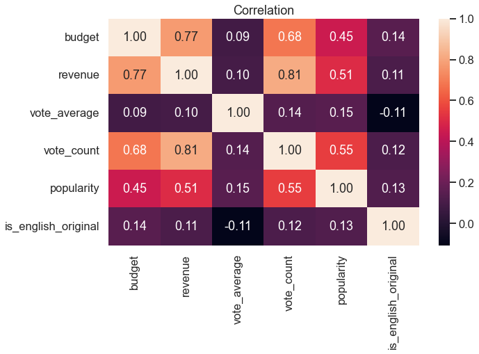
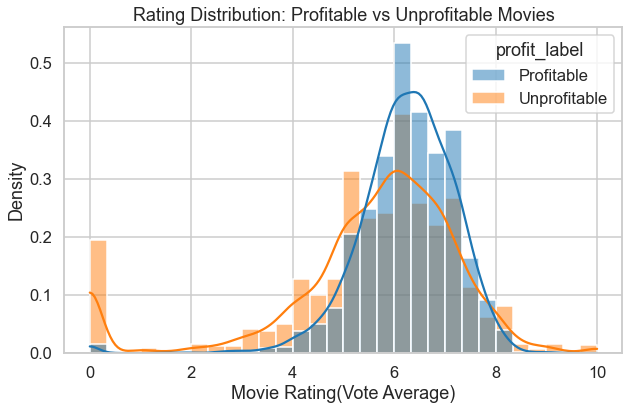
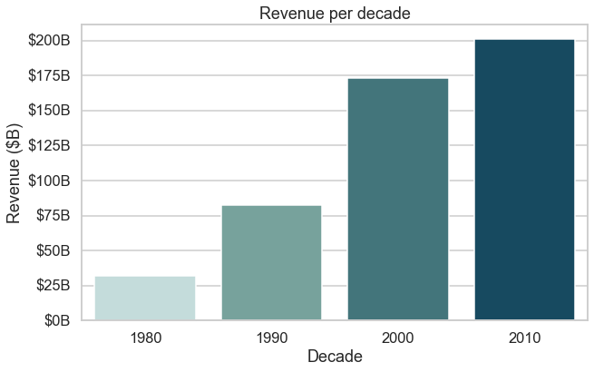
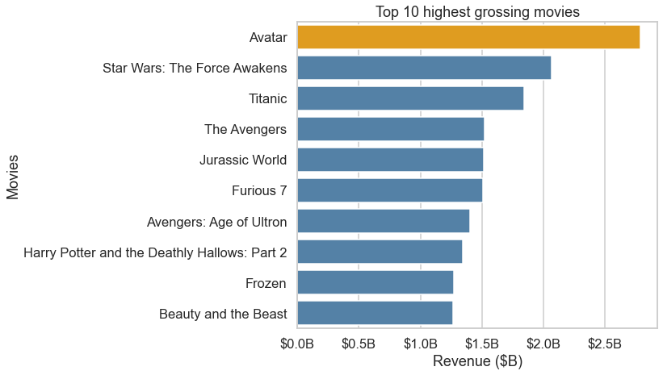

{\rtf1\ansi\ansicpg1252\cocoartf2761
\cocoatextscaling0\cocoaplatform0{\fonttbl\f0\fswiss\fcharset0 Helvetica;\f1\fnil\fcharset0 LucidaGrande;}
{\colortbl;\red255\green255\blue255;}
{\*\expandedcolortbl;;}
\margl1440\margr1440\vieww22240\viewh14420\viewkind0
\pard\tx720\tx1440\tx2160\tx2880\tx3600\tx4320\tx5040\tx5760\tx6480\tx7200\tx7920\tx8640\pardirnatural\partightenfactor0

\f0\fs24 \cf0 # Movie EDA \'97 What Actually Drives Box Office Success?\
\
An exploratory data analysis of ~45,000 movies from the TMDB dataset, examining \
the relationships between budget, revenue, audience ratings, language, and release decade.\
\
---\
\
## Project Overview\
\
This project explores what factors are most associated with movie financial \
performance, using real-world data cleaning, feature engineering, and visual \
storytelling with Python.\
\
**Dataset:** TMDB Movies Metadata (~45,000 records)  \
**Tools:** Python \'b7 Pandas \'b7 Matplotlib \'b7 Seaborn\
\
---\
\
## Questions Explored\
\
1. Do bigger budgets mean bigger revenue?\
2. Are better-rated movies more profitable?\
3. How has film revenue changed across decades?\
4. Which movies made the most money?\
\
---\
\
## Key Findings\
\
Budget had the strongest relationship with revenue \'97 bigger productions tend to \
earn more, which makes intuitive sense. What was more interesting was that vote \
count (a measure of audience reach) turned out to be a slightly stronger revenue \
predictor than budget itself (r = 0.81 vs 0.77). Ratings, on the other hand, \
barely moved the needle on profitability (r = 0.10).\
\
The data has real limitations. Financial records had missing values and \
inconsistencies, so these findings are directional rather than definitive. \
But the core question \'97 what makes a movie financially successful \'97 turned out \
to be more nuanced than the numbers alone can answer.\
\
---\
\
## Visualizations\
\
### 1. Correlation heatmap\
\
Budget\'96revenue correlation: 0.77. Vote count is the strongest revenue predictor \
at 0.81. Ratings show almost no relationship with revenue (0.10).\
\
### 2. Rating distribution: profitable vs unprofitable\
\
Profitable films peak around 6\'967; unprofitable ones are more spread with a spike \
near 0. The overlap between groups is too large to use ratings as a reliable predictor.\
\
### 3. Revenue by decade\
\
Clear upward trend from ~$30B in the 1980s to ~$200B in the 2010s, with the \
steepest jump between the 1990s (~$80B) and 2000s (~$175B).\
\
### 4. Top 10 highest-grossing movies\
\
\pard\pardeftab720\partightenfactor0
\cf0 All 10 titles exceeded $1.3B. Avatar leads by a wide margin, followed by Star Wars: The Force Awakens and Titanic.\
\pard\tx720\tx1440\tx2160\tx2880\tx3600\tx4320\tx5040\tx5760\tx6480\tx7200\tx7920\tx8640\pardirnatural\partightenfactor0
\cf0 \
---\
\
## Data Cleaning Highlights\
\
- Converted `id`, `budget`, and `revenue` from mixed-type objects to numeric\
- Removed 3 invalid IDs and 59 duplicate records\
- Engineered `is_english_original` binary feature\
- Cleaned `popularity` column (formatting inconsistencies)\
- Parsed `release_date` 
\f1 \uc0\u8594 
\f0  extracted year and decade; filtered to 1980+\
\
---\
\
## How to Run\
\pard\pardeftab720\partightenfactor0
\cf0 ```bash\
\pard\tx720\tx1440\tx2160\tx2880\tx3600\tx4320\tx5040\tx5760\tx6480\tx7200\tx7920\tx8640\pardirnatural\partightenfactor0
\cf0 git clone https://github.com/Albertosd8/movie-revenue-eda\
cd movie-revenue-eda\
pip install pandas matplotlib seaborn\
jupyter notebook movie_dataset_eda.ipynb\
\pard\pardeftab720\partightenfactor0
\cf0 ```\
\pard\tx720\tx1440\tx2160\tx2880\tx3600\tx4320\tx5040\tx5760\tx6480\tx7200\tx7920\tx8640\pardirnatural\partightenfactor0
\cf0 Dataset: [TMDB Movies Metadata on Kaggle](https://www.kaggle.com/datasets/rounakbanik/the-movies-dataset)\
---\
\
## About\
\
Built by Alberto Sandoval.\
Feedback welcome via Issues or LinkedIn: https://www.linkedin.com/in/alberto-sandoval-6b79ab14a}